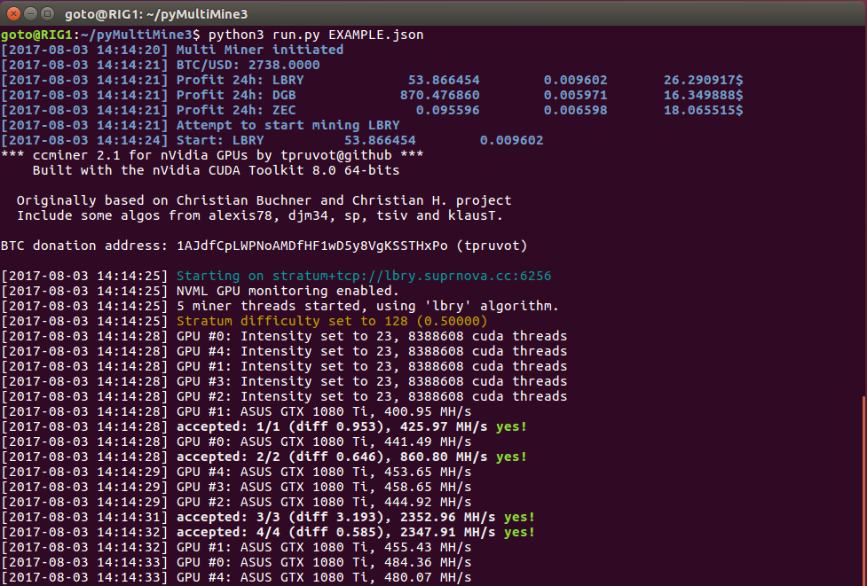

# pyMultiMine
*pyMultiMine* is cryptocurrency mining driver that allows switching between different currencies, mining software and algorithms based on current mining profitability. Mining profitability is calculated based on **Net Hash Rate**, **Difficulty**, **Block Time**, **Block Size**, **Exchange rate to BTC** (all from *http://WhatToMine.com*) and computer (mining rig) **Hash Rate** (set individually for all currencies / algorithms). *pyMultiMine* displays profitability in **BTC / day** and **USD / day** based on current BTC to USD exchange rate from http://CryptoWat.ch.

If you find this software useful, please say thank you by donating some BTC:
<big><p style="text-align: center;">1DMcHCDus3izk7ia54R6BJfhDaf4visgnT</p></big>

## TL;DR

1. Create setup file as in given `EXAMPLE.json`
2. Run and collect profit: `python3 run.py EXAMPLE.json`



# Usage

## Setup

All user selectable parameters can be set in JSON config file (see *EXAMPLE.json*). There are two parts of config file:

1. **config**
	* **CheckCoinsEvery**: integer number of seconds between profitablility recalculation. Recommended between 60 and 900 seconds (1 to 15 minutes)
	* **BTCUSDMarket**: name of market for BTC to USD rate. Can by one of markets supported by http://CryptoWat.ch ("kraken", "bitfinex", "poloniex", etc.) 
	* **DryRun**: if set to 0 disables starting mining processes
	* **DebugTarge**: set to 0 to disable debug messages (recommended for standard user). Set to 1 to print debug messages to log file. Set to 2 to print debug messages to screen or set it to 3 to print debug messages to both file and screen.
2. **coins**
	* Can contain definition of any number of cryptocurrencies. For each cryptocurrency ("coin") it is required to specify following:
		* Coin short name as JSON key (ex. "ZEC", see notes below)
		* **FullName**: full coin name (ex. "Zcash", see notes below),
		* **Default**: if set to 1 this coin is going to be mined if calculation of profitability fails
		* **Enabled**: if set to 0 this coin is ignored
		* **Executable**: full system command for starting mining the coin, including full executable path (ex. `/home/goto/Documents/0.3.4b/miner --server eu1-zcash.flypool.org --user t1Wa6JG1w3m9d81q78Mg2uockRVZ6vuoE6L.rig1 --pass x --port 3333 --pec --fee 0`),
		* **HashRate**: integer number of hashes per second for the machine (ex. 3.4e3, see notes below),
		* **MinMineTime**: integer number of seconds of minimal mining time. To avoid very often switching between coin it is recommended to set minimal mining time for each coin (ex. 180 - algorithm / coin won't be changed for 180 seconds after start) 

### Explanations
Coin short and full name must be compatible with *http://WhatToMine.com*. If you want to print current list of coins supported by *http://WhatToMine.com* execute `python3 ListAllCoins.py`. As of August 2017 31 coins are supported including:
*  BCN : Bytecoin
*  DGB : DGB-Groestl
*  LBC : LBRY
*  ZEC : Zcash

Machine Hash Rate needs to be set individually for all coins (note, that multiple coins may share same algorithm). It's recommended to use value reported by mining software, not mining pool. All mining software reports hash rate frequently during run. Be careful to set hash rate in hashes per second, remembering that: 
* 1 kH/s is 1.000 H/s or `10e3` H/s
* 1 MH/s is 1.000.000 H/s or `10e6` H/s
* 1 GH/s is 1.000.000.000 H/s or `10e9` H/s

*pyMultiMine* is only driver for mining software - it does not do any mining, it can control starting and stopping other mining software. Before starting *pyMultiMine* you should test mining software setup for each coin you are going to mine. Remember, that you must specify full path to miner executable. 

*pyMultiMine* should work with any command line mining software and have been tested with `ccminer` and `EWBF CUDA ZCash miner`. If you have positive experience with other mining software, please let me know.

## Running
When your JSON config file is completed you can start mining:

```python3 run.py EXAMPLE.json```

During runtime *pyMultiMine* will display current profits for all coins and information about starting, stopping or continuing to mine given coin. During runtime standard output of miner software will be displayed. 